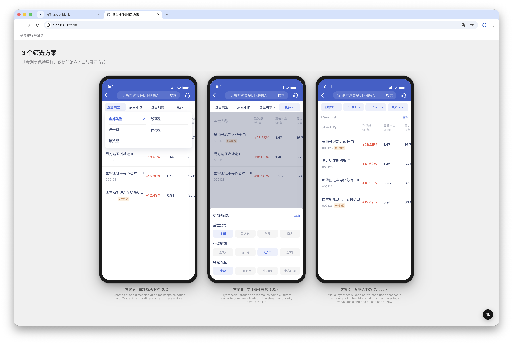

# WeBank Design 插件

## 如何安装

在 Codex Desktop 中安装 WeBank Design 插件。插件同时提供 `brainstorm` 与 `setup-profile` 两个 Skill；插件更新时，内置产品档案也会随插件版本更新。

如果要在某个工作区维护自己的产品档案，先运行：

```text
$setup-profile 将内置产品档案复制到当前工作区
```

它会创建固定目录 `./wb-design-profile`，且不会覆盖已经存在的工作区档案。之后 `brainstorm` 会优先使用这个工作区档案；目录不存在时使用插件内置档案。

工作区档案不完整时，Brainstorm 会先报告缺失项，并尽量使用已有模板、设计资产和用户提供的设计来源继续当前任务。只有缺失项确实阻止生成、校验或预览时，才会让用户选择：本次改用内置档案，或先补齐工作区档案。修复操作只复制缺失的内置文件，不覆盖已有自定义内容。

## Skill 详情

### `brainstorm`

交互式设计头脑风暴：澄清需求 → 生成多个方案 → 选择某个方案进行细化。适用于从零设计界面，或探索已有设计的其他可能性。

#### Prompt 示例

```text
$brainstorm 给基金详情页增加筛选功能
```

```text
$brainstorm 基于这个设计多出几个不同的方案：https://figma.com/design/xxxx
```

#### Skill 会做什么

当你向 Brainstorm 提出需求时，Skill 会执行以下工作流：

1. **澄清需求**：与你进行多轮对话，澄清需求。
2. **启动本地预览服务**：启动 SSE 热更新的本地 Node 服务（`scripts/serve-preview.cjs`），让你可以在浏览器中实时预览界面修改。预览页右下角可进入批注模式：点手机屏幕内的元素写一句话，Agent 下一轮会读取并直接修改，不用再用文字描述是哪个元素。仅手机屏幕内可批注；顶部导航等平台外壳不可批注。
3. **基准模板与产品规则对齐**：优先选择工作区的 `./wb-design-profile`，否则使用插件内置档案；再读取其中的 `PROFILE.md`、`screens/` HTML 模板和可选产品知识，确保设计在视觉和逻辑上都不偏离产品规范。
4. **生产模板优先的多方案生成**：先复制统一的 `assets/page-template.html` 页面壳，再以最接近的生产模板 DOM 和 class 为起点，只生成各方向真正不同的部分；模板局部 CSS 在同一方案页只保留一份。预览服务会自动链接手机 mockup 样式并注入当前平台包的预览外壳，供用户直观对比。
5. **质检**：在交付设计前，内部调用 **Simplify（精简设计）** 以及产品档案声明的 pass，自我修正冗余元素、数值计算错漏及样式缺陷；若当前环境支持（如安装了 Playwright MCP、Chrome DevTools MCP 或其他浏览器自动化工具），还会自动访问页面并截图，完成视觉 QA 自检与纠错。
6. **选择后续分支**：方案定稿后，Skill 会依次组合反馈、共享 Push to Figma、产品档案声明的分支，以及当前平台包提供的分支，再临时分配选项字母。默认档案可将页面**推送到 Figma 画布**。

#### 效果预览

Brainstorm 在对话中澄清设计目标并生成方案：


在浏览器中并排预览和比较多个设计方向：



建议使用 GPT 5.6-sol-high 或以上能力的模型。
实际测试对比 GPT 5.6-luna-medium，sol 在澄清需求及生成质量上有明显提升。

### `setup-profile`

管理当前工作区的产品档案：复制插件内置档案，或根据 Figma URL、截图、现有 HTML、本地实现和文字说明等来源添加生产模板。

#### Prompt 示例

```text
$setup-profile 将内置产品档案复制到当前工作区
```

```text
$setup-profile 根据这个 Figma 节点添加一个基金筛选页模板：https://figma.com/design/xxxx
```

```text
$setup-profile 根据我附上的截图添加页面模板
```

添加模板时，如果 `./wb-design-profile` 尚不存在，Skill 会先复制内置档案；新增 HTML、静态资源和 `PROFILE.md` 模板路由都只写入工作区副本，因此插件更新不会覆盖用户自定义内容。


## 插件开发说明

见[DEVELOPER.md](DEVELOPER.md)
